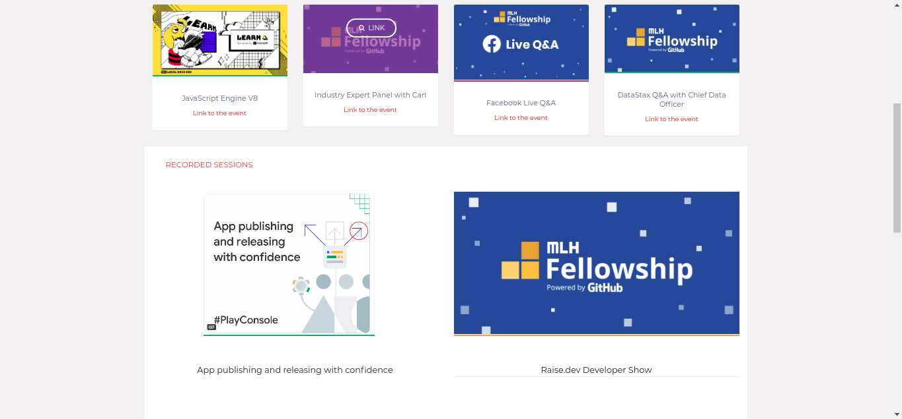

# MLH Session
> Short blurb about what your product does.


One to two paragraph statement about your product and what it does.



## Installation

Make sure you have the Angular CLI installed globally.
Run ng serve for a dev server. Navigate to http://localhost:4200/. The app will automatically reload if you change any of the source files.

## Run the web App

```
cd MLHSessions
ng serve
```


## Contributing

1. Fork it (https://github.com/AyoubDali/MLHSessions.git)
2. Create your feature branch (`git checkout -b feature/mybranch`)
3. Commit your changes (`git commit -am 'Add some mybranch'`)
4. Push to the branch (`git push origin feature/mybranch`)
5. Create a new Pull Request


